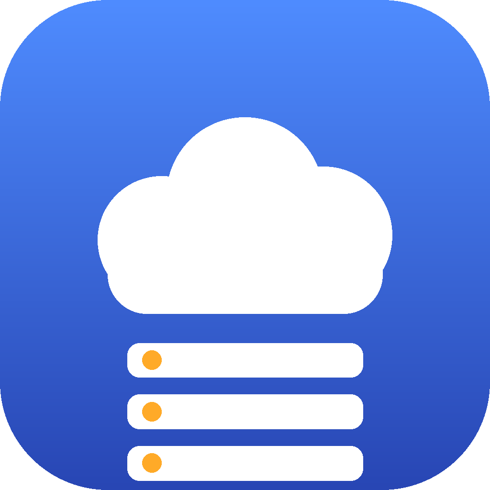

<div align="center">



# AOWcloud Xampp

**Przenośny menedżer wirtualnych hostów dla XAMPP na Windows.**
Trzymaj XAMPP, projekty i ten program na jednym dysku przenośnym i pracuj na wielu
komputerach - mimo że litera dysku i plik `hosts` są na każdym inne.


-512BD4?logo=dotnet&logoColor=white)


</div>

---

## Po co to jest

XAMPP na dysku przenośnym + praca na kilku komputerach rodzi dwa uciążliwe problemy:

1. **Litera dysku się zmienia** - na jednym komputerze dysk to `S:`, na innym `E:` lub `F:`.
   Apache potrzebuje w `DocumentRoot` ścieżek absolutnych, więc „ręczne" `vhosts.conf`
   przestaje pasować po przepięciu dysku.
2. **Plik `hosts` jest lokalny na każdym komputerze** (`C:\Windows\System32\drivers\etc\hosts`),
   a nie na dysku - więc wpisy `127.0.0.1 projekt.test` trzeba dodawać osobno na każdej maszynie.

**AOWcloud Xampp** rozwiązuje oba: jest jednym źródłem prawdy o liście vhostów (na dysku),
a przy każdym starcie sam dopasowuje lokalne pliki Windows do aktualnej litery i komputera.

## Funkcje

- 🔌 **Wykrywanie litery dysku w runtime** - żadnego hardkodowanego `S:`. Ścieżki projektów
  trzymane są **względnie** i rozwijane do pełnych dopiero przy starcie.
- ♻️ **Regeneracja `httpd-vhosts.conf`** przy każdym uruchomieniu, z aktualną literą dysku
  i ścieżkami w formacie Apache (`E:/projekty/sklep`).
- 🧩 **Reconcile pliku `hosts`** - dodaje brakujące i usuwa nieistniejące `ServerName`
  aktywnych projektów, **tylko** w obrębie własnej sekcji markerów.
- 🔒 **Automatyczny HTTPS (443)** - dla każdego projektu generowany jest też blok SSL
  (certyfikat XAMPP), więc `https://projekt.test` trafia tam, gdzie trzeba.
- 💾 **Kopie `.bak`** każdego edytowanego pliku (z timestampem) przed zapisem.
- 🖤 **Ciemny motyw**, lista projektów (DataGrid), dodawanie/edycja/usuwanie, otwieranie w przeglądarce.
- 🧳 **Zero śladów na hoście** poza niezbędną sekcją w `hosts`. Brak `%APPDATA%`.

## Jak działa przenośność

Program, jego dane i XAMPP leżą **razem na dysku przenośnym**. Komputer jest „tymczasowy" -
przy każdym starcie następuje synchronizacja:

```
1. Wykryj literę dysku z położenia .exe (AppContext.BaseDirectory).
2. Wczytaj config.json (ścieżki projektów zapisane WZGLĘDNIE).
3. Rozwiń ścieżki do aktualnej litery.
4. Zregeneruj sekcję w httpd-vhosts.conf (pełne, aktualne ścieżki).
5. Reconcile lokalnego hosts (dodaj brakujące / usuń nieistniejące).
6. Pokaż baner i - jeśli coś się zmieniło - zaproponuj restart Apache.
```

Dzięki temu: dodajesz vhosta na komputerze **X** → zapis na dysku → wpinasz dysk w komputerze
**Y** → program przy starcie sam dopisuje wpis do `hosts` komputera Y i odświeża `vhosts.conf`.

## Edytowane pliki i markery

| Plik | Lokalizacja | Uwaga |
|------|-------------|-------|
| `httpd-vhosts.conf` | `<dysk>\xampp\apache\conf\extra\` | na dysku, ścieżka konfigurowalna |
| `hosts` | `C:\Windows\System32\drivers\etc\` | lokalny na hoście, ścieżkę można nadpisać |

W obu plikach zmieniana jest **wyłącznie** treść między markerami - wpisy użytkownika poza
nimi pozostają nietknięte:

```
# === AOWcloud Xampp START ===
...wpisy zarządzane przez program...
# === AOWcloud Xampp END ===
```

## Wymagania

- **Windows 10/11 (x64)**.
- **XAMPP** na dysku przenośnym w katalogu `xampp` (obok katalogu programu).
- **Uprawnienia administratora** - edycja `hosts` i restart Apache tego wymagają
  (`app.manifest` wymusza UAC).
- Do zbudowania: **.NET 8 SDK** (działa też nowszy, np. 9.x). Gotowy `.exe` **nie**
  wymaga zainstalowanego .NET (build self-contained).

## Build

Z katalogu, w którym leży `AOWcloudXampp.csproj`:

```powershell
dotnet publish -c Release
```

Parametry single-file / self-contained / `win-x64` oraz ikona są już ustawione w `.csproj`.
Wynik:

```
bin\Release\net8.0-windows\win-x64\publish\AOWcloudXampp.exe
```

## Instalacja na dysku przenośnym

Skopiuj `AOWcloudXampp.exe` na dysk tak, aby obok znajdował się katalog `xampp`:

```
<dysk>\AOWcloudXampp.exe
<dysk>\AOWcloud-Xampp\       (tworzone automatycznie obok .exe: config.json, backups\)
<dysk>\xampp\...
<dysk>\projekty\...
```

> Folder danych `AOWcloud-Xampp\` powstaje zawsze **obok `.exe`**. Litera dysku jest brana
> z położenia `.exe`, więc ważne jest tylko, by `xampp` był pod tą samą literą.

## Pierwsze uruchomienie na nowym komputerze

1. Wepnij dysk przenośny.
2. Uruchom `AOWcloudXampp.exe` **jako administrator** (UAC zapyta o zgodę).
3. Program wykryje literę dysku, wczyta `config.json`, zregeneruje `vhosts.conf`
   i wykona reconcile `hosts`.
4. W banerze pojawi się np. `Wykryto dysk: E: | Host: DESKTOP-Y | Zsynchronizowano N projektów`.
5. Gdy coś się zmieniło - program zaproponuje restart Apache.

## Ustawienia

W oknie **Ustawienia** ustawisz m.in.: ścieżkę do `httpd-vhosts.conf`, `httpd.exe` i `hosts`,
generowanie bloków HTTPS oraz ścieżki certyfikatu SSL, a także pytanie o restart Apache.
Puste pole = wartość domyślna (auto-wykryta od litery dysku).

## Struktura kodu (MVVM)

```
Models/      ProjectModel, AppSettings, AppConfig
Services/    DriveService (litera dysku + ścieżki względne<->absolutne)
             ConfigService (JSON na dysku), BackupService (.bak)
             VHostFileService (regeneracja vhosts), HostsFileService (reconcile)
             ApacheService (httpd -t / restart), MarkerSection (sekcje markerów)
             SyncService (sekwencja startowa)
ViewModels/  MainViewModel, ProjectRowViewModel, ProjectEditViewModel,
             ViewModelBase, RelayCommand
Views/       MainWindow, ProjectEditDialog, SettingsDialog
Themes/      DarkTheme.xaml
icon.ico     ikona aplikacji
```

> Wewnętrzna przestrzeń nazw kodu to `XamppVHostManager` - to identyfikator techniczny,
> nie nazwa programu. Nazwa produktu i pliku `.exe` to **AOWcloud Xampp** / `AOWcloudXampp.exe`.

## Zrzuty ekranu

Zrzuty ekranu możesz dodać do katalogu `assets/` i podlinkować tutaj, np.
``.

---

Copyright © 2026 vTomsonek
